# Architecture — Agentic Employee Onboarding System

This document describes the complete architecture of the onboarding platform: services, agents, event flow, data model, frontend, infrastructure, and optional Supabase integration.

---

## Table of Contents

- [Architectural Overview](#architectural-overview)
- [High-Level Component Diagram](#high-level-component-diagram)
- [Deployment Topology](#deployment-topology)
- [API Gateway](#api-gateway)
- [Workflow Orchestrator](#workflow-orchestrator)
- [Event Bus (Redis)](#event-bus-redis)
- [Cognitive Agents](#cognitive-agents)
- [Microservices](#microservices)
- [Shared Packages](#shared-packages)
- [Database Schema](#database-schema)
- [Frontend Architecture](#frontend-architecture)
- [Authentication & Authorization](#authentication--authorization)
- [Monitoring & Observability](#monitoring--observability)
- [Supabase Integration](#supabase-integration)
- [Legacy Backend Stack](#legacy-backend-stack)
- [Security Considerations](#security-considerations)

---

## Architectural Overview

The system follows an **event-driven microservices** pattern:

1. **Synchronous path:** Frontend → API Gateway → Agents (inline) → Microservices → PostgreSQL
2. **Asynchronous path:** Agents publish events → Redis queue → Orchestrator → Agents → Microservices

Agents are **not separate containers** — they are Python classes imported by the Gateway (for synchronous operations) and the Orchestrator (for async workflow steps).

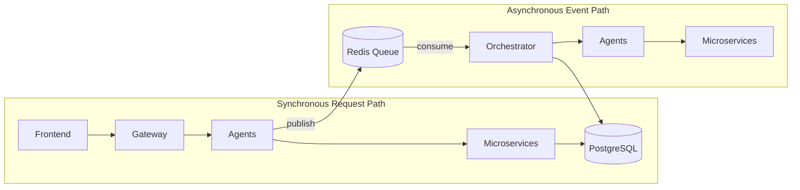

### Design Principles

| Principle | Implementation |
|-----------|----------------|
| **Ephemeral documents** | PDFs processed in-memory in OCR service; no persistent file storage |
| **Event-driven workflow** | Redis LPUSH/BRPOP with retry and DLQ |
| **Separation of concerns** | Each microservice owns one domain (OCR, verification, email, inventory, IT) |
| **Agent orchestration** | Agents coordinate HTTP calls and event publishing |
| **Role-based access** | Gateway enforces RBAC on every protected route |

---

## High-Level Component Diagram

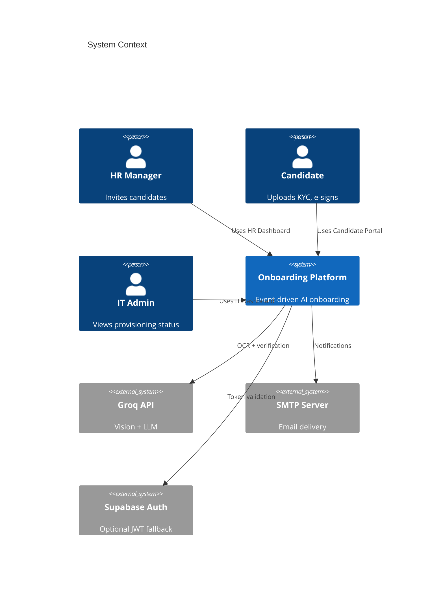

---

## Deployment Topology

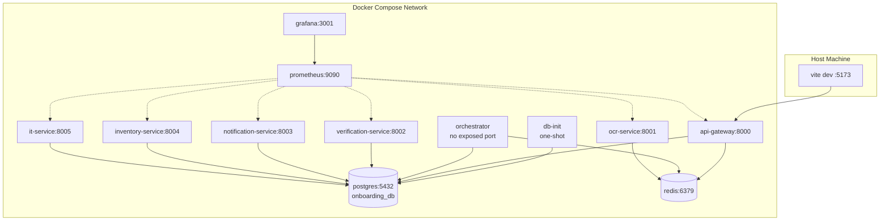

### Container Summary

| Container | Image / Build | Port | Purpose |
|-----------|---------------|------|---------|
| `onboarding_postgres` | `postgres:15` | 5432 | Primary relational database |
| `onboarding_redis` | `redis:7-alpine` | 6379 | Event bus (AOF persistence) |
| `onboarding_db_init` | `python:3.11-slim` | — | Schema init + seed (exits after completion) |
| `onboarding_gateway` | `apps/gateway/Dockerfile` | 8000 | REST API, auth, RBAC |
| `onboarding_orchestrator` | `apps/orchestrator/Dockerfile` | — | Background event consumer |
| `onboarding_ocr` | `services/ocr-service/Dockerfile` | 8001 | PDF OCR extraction |
| `onboarding_verification` | `services/verification-service/Dockerfile` | 8002 | KYC validation + e-sign |
| `onboarding_notification` | `services/notification-service/Dockerfile` | 8003 | SMTP email dispatch |
| `onboarding_inventory` | `services/inventory-service/Dockerfile` | 8004 | Asset catalog + assignment |
| `onboarding_it` | `services/it-service/Dockerfile` | 8005 | Corporate account provisioning |
| `onboarding_prometheus` | `prom/prometheus:latest` | 9090 | Health scrape targets |
| `onboarding_grafana` | `grafana/grafana:latest` | 3001→3000 | Dashboards (admin/admin) |

**PYTHONPATH** in gateway and orchestrator containers: `/app:/app/packages:/app/agents`

---

## API Gateway

**Location:** `apps/gateway/main.py`  
**Framework:** FastAPI  
**Port:** 8000

The gateway is the single entry point for the frontend. It handles authentication, role enforcement, and delegates business logic to agent classes.

### Route Map

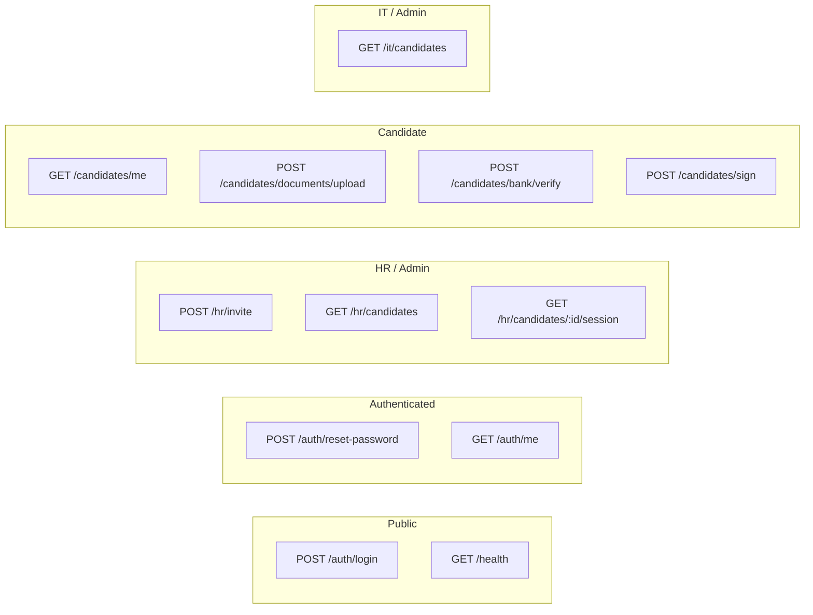

| Method | Path | Roles | Handler |
|--------|------|-------|---------|
| POST | `/auth/login` | Public | Local JWT login (bcrypt password verify) |
| POST | `/auth/reset-password` | Any authenticated | Force password reset |
| GET | `/auth/me` | Any authenticated | Current user profile |
| POST | `/hr/invite` | hr, admin | `HRIntakeAgent.invite_candidate()` |
| GET | `/hr/candidates` | hr, admin | List all candidates with user info |
| GET | `/hr/candidates/{id}/session` | hr, admin | Session state + workflow events |
| GET | `/candidates/me` | candidate | Full profile, docs, assets, verification records |
| POST | `/candidates/documents/upload` | candidate | `VerificationAgent.process_document_upload()` |
| POST | `/candidates/bank/verify` | candidate | `VerificationAgent.verify_bank_details()` |
| POST | `/candidates/sign` | candidate | `VerificationAgent.sign_offer_letter()` |
| GET | `/it/candidates` | it, admin | Candidates with KYC, corporate email, assets |
| GET | `/health` | Public | `{"status": "ok"}` |

### Middleware

- **CORS:** `CORSMiddleware` wraps the entire app (outermost ASGI layer)
- Origins from `CORS_ALLOWED_ORIGINS` or `FRONTEND_URL`; defaults to localhost 5173/3000
- Regex fallback: `^https?://(localhost|127\.0\.0\.1)(:\d+)?$`

### Dependencies

```
fastapi, uvicorn, httpx, asyncpg, passlib, bcrypt, python-jose, redis, pydantic-settings
```

**Key file:** `apps/gateway/Dockerfile`

---

## Workflow Orchestrator

**Location:** `apps/orchestrator/orchestrator.py`  
**Type:** Long-running background worker (no HTTP port)

The orchestrator subscribes to the Redis `onboarding_events` queue and drives the async onboarding workflow.

### Event Handler Logic

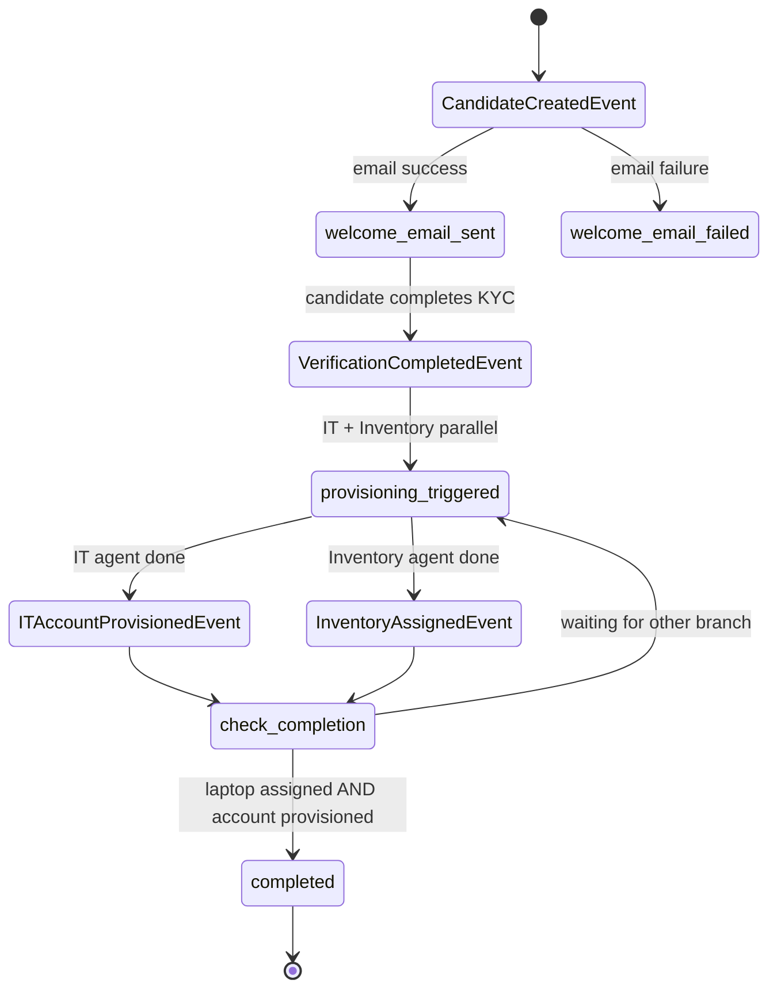

### Event Handlers

| Event | Actions |
|-------|---------|
| `CandidateCreatedEvent` | Send welcome email via NotificationAgent; update session step |
| `VerificationCompletedEvent` | Run IT Agent + Inventory Agent **in parallel** (`asyncio.gather`); set step to `provisioning_triggered` |
| `ITAccountProvisionedEvent` | Email corporate credentials; swap user login to work email; set candidate status to `it_provisioning`; check completion |
| `InventoryAssignedEvent` | Check workflow completion |

### Completion Criteria

Onboarding completes when **both** conditions are met:

1. Laptop assigned (`inventory_assignments` + `asset_type = 'laptop'`)
2. IT account exists (`company_accounts` row)

Then: `candidates.status = 'onboarded'`, `onboarding_sessions.status = 'completed'`, audit log written.

All handled events are persisted to `workflow_events` with `processed_by = 'orchestrator'`.

---

## Event Bus (Redis)

**Location:** `packages/event_contracts/broker.py`  
**Class:** `RedisEventBus`

### Redis Data Structures

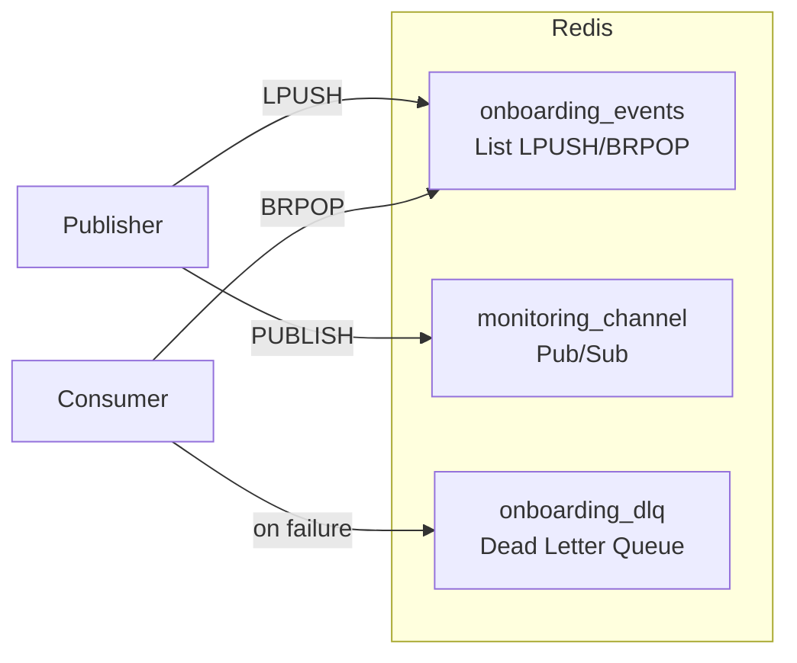

| Key / Channel | Type | Purpose |
|---------------|------|---------|
| `onboarding_events` | List | Main FIFO event queue (LPUSH producer, BRPOP consumer) |
| `monitoring_channel` | Pub/Sub | Real-time event broadcast (no consumer in repo) |
| `onboarding_dlq` | List | Failed events after max retries |

### Event Message Schema

```json
{
  "event_id": "uuid",
  "event_type": "CandidateCreatedEvent",
  "timestamp": 1716643200.0,
  "payload": { "candidate_id": 1, "session_id": 1, "email": "..." },
  "retries": 0,
  "max_retries": 3
}
```

### Event Types

| Event | Publisher | Payload Fields |
|-------|-----------|----------------|
| `CandidateCreatedEvent` | HR Agent | candidate_id, session_id, email, name, temp_password |
| `VerificationCompletedEvent` | Verification Agent | candidate_id, session_id |
| `ITAccountProvisionedEvent` | IT Agent | candidate_id, session_id, employee_id, work_email, temp_password |
| `InventoryAssignedEvent` | Inventory Agent | candidate_id, session_id, assets |

### Retry & DLQ

- On handler exception: increment `retries`, delay 5s, re-queue
- After 3 retries: push to `onboarding_dlq` with error message

---

## Cognitive Agents

Agents are Python classes in `agents/` that coordinate microservice calls and Redis events. They run **in-process** within the Gateway or Orchestrator.

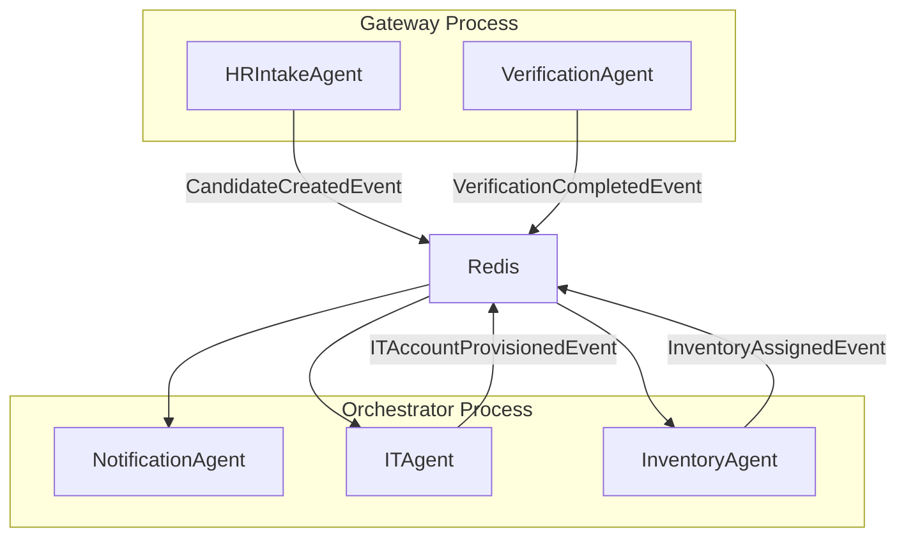

### HR Intake Agent

**File:** `agents/hr_agent/hr_agent.py`  
**Class:** `HRIntakeAgent`

| Aspect | Detail |
|--------|--------|
| **Trigger** | Gateway `POST /hr/invite` |
| **Input** | name, email, department, job_title, start_date |
| **Actions** | Validate email (typo detection), create/update user + candidate, create onboarding session, generate temp password, audit log |
| **Output** | Publishes `CandidateCreatedEvent` |
| **Dependencies** | PostgreSQL, RedisEventBus |

### Verification Agent

**File:** `agents/verification_agent/verification_agent.py`  
**Class:** `VerificationAgent`

| Aspect | Detail |
|--------|--------|
| **Trigger** | Gateway document upload, bank verify, e-sign routes |
| **Document flow** | OCR Service → Verification Service → update candidate status → check workflow progress |
| **Completion check** | When PAN + Aadhaar + bank verified + offer signed → publish `VerificationCompletedEvent` |
| **Dependencies** | OCR (8001), Verification (8002), PostgreSQL, Redis |

### Notification Agent

**File:** `agents/notification_agent/notification_agent.py`  
**Class:** `NotificationAgent`

| Aspect | Detail |
|--------|--------|
| **Trigger** | Orchestrator (not gateway) |
| **Methods** | `send_welcome_email()`, `send_company_account_credentials()` |
| **Dependencies** | Notification Service (8003) via HTTP |
| **Templates** | HTML emails with portal URL, credentials, instructions |

### IT Agent

**File:** `agents/it_agent/it_agent.py`  
**Class:** `ITAgent`

| Aspect | Detail |
|--------|--------|
| **Trigger** | Orchestrator on `VerificationCompletedEvent` |
| **Actions** | `POST /it/provision` → publish `ITAccountProvisionedEvent` |
| **Dependencies** | IT Service (8005), Redis |

### Inventory Agent

**File:** `agents/inventory_agent/inventory_agent.py`  
**Class:** `InventoryAgent`

| Aspect | Detail |
|--------|--------|
| **Trigger** | Orchestrator on `VerificationCompletedEvent` |
| **Actions** | Assign laptop, then accessories → publish `InventoryAssignedEvent` |
| **Dependencies** | Inventory Service (8004), Redis |

---

## Microservices

### OCR Service (Port 8001)

**File:** `services/ocr-service/main.py`

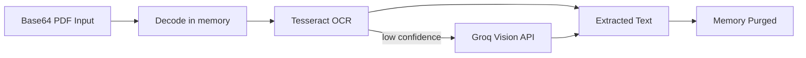

| Endpoint | Method | Description |
|----------|--------|-------------|
| `/ocr/extract` | POST | Extract text from PDF (base64) |
| `/health` | GET | Health check |

**Processing pipeline:**

1. Decode base64 PDF into memory (no disk write)
2. Try PyPDF2 text extraction
3. Render PDF pages with PyMuPDF → Tesseract OCR
4. If confidence low and `GROQ_API_KEY` set → Groq Vision fallback
5. Return text + confidence; memory purged immediately

**Env vars:** `GROQ_API_KEY`, `OPENAI_BASE_URL`, `VISION_MODEL`, `TESSERACT_MODEL`

**System deps (Docker):** Tesseract OCR, poppler, PyMuPDF

---

### Verification Service (Port 8002)

**File:** `services/verification-service/main.py`

| Endpoint | Method | Description |
|----------|--------|-------------|
| `/verification/verify-document` | POST | OCR text → extract PAN/Aadhaar/bank fields → validate |
| `/verification/verify-bank` | POST | Validate bank account + IFSC + name |
| `/verification/sign-offer-letter` | POST | Record e-signature with IP + timestamp |
| `/health` | GET | Health check |

**Validation rules:**

| Field | Rule |
|-------|------|
| PAN | `[A-Z]{5}[0-9]{4}[A-Z]{1}` |
| Aadhaar | 12 digits, not starting with 0/1, not all same digit |
| IFSC | `[A-Z]{4}0[A-Z0-9]{6}` |
| Bank account | 9–18 digits |

**Optional:** Groq LLM for fuzzy name/DOB matching across documents.

**Database writes:** `verification_records`, `extracted_document_data`, `audit_logs`

---

### Notification Service (Port 8003)

**File:** `services/notification-service/main.py`

| Endpoint | Method | Description |
|----------|--------|-------------|
| `/notifications/send` | POST | Send HTML email via SMTP |
| `/notifications/logs` | GET | List email delivery logs |
| `/health` | GET | Health check |

**Behavior:**

- If SMTP credentials missing or placeholder → logs as `sent_mock` (dev-friendly)
- All attempts logged to `email_logs` table

**Env vars:** `SMTP_HOST`, `SMTP_PORT`, `SMTP_USER`, `SMTP_PASSWORD`, `EMAIL_FROM`, `EMAIL_FROM_NAME`

---

### Inventory Service (Port 8004)

**File:** `services/inventory-service/main.py`

| Endpoint | Method | Description |
|----------|--------|-------------|
| `/inventory/assets` | GET | List all inventory assets |
| `/inventory/assign` | POST | Assign asset by type to candidate |
| `/health` | GET | Health check |

**Assignment logic:**

1. Check if candidate already has asset of requested type
2. Find first available asset from `inventory_assets`
3. If none available → create mock asset (dev fallback)
4. Insert into `inventory_assignments`, mark asset as `assigned`

---

### IT Service (Port 8005)

**File:** `services/it-service/main.py`

| Endpoint | Method | Description |
|----------|--------|-------------|
| `/it/provision` | POST | Create corporate email + employee ID |
| `/health` | GET | Health check |

**Provisioning logic:**

1. Generate work email: `first.last@COMPANY_DOMAIN`
2. Generate employee ID: `EMP-{year}-{random}`
3. Generate temp password (upper + lower + digit + special)
4. Insert into `company_accounts`, update `candidates.employee_id` and `candidates.work_email`
5. Idempotent — returns existing account if already provisioned

**Env vars:** `COMPANY_DOMAIN` (default: `company.com`)

---

## Shared Packages

### event_contracts

**Path:** `packages/event_contracts/`

| Module | Purpose |
|--------|---------|
| `broker.py` | `RedisEventBus` — connect, publish, listen (BRPOP), retry, DLQ |

### shared_types

**Path:** `packages/shared_types/`

| Module | Purpose |
|--------|---------|
| `types.py` | Pydantic models: `CandidateCreate`, `CandidateResponse`, `ExtractedDocDataSchema`, `EventMessage` |

### shared_utils

**Path:** `packages/shared_utils/`

| Module | Purpose |
|--------|---------|
| `init_db.py` | Authoritative schema — DROP + CREATE all 12 tables |
| `seed_db.py` | Demo users, candidate, inventory assets, training modules |

---

## Database Schema

**Authoritative source:** `packages/shared_utils/init_db.py`  
**Note:** Drops and recreates all tables on each run. Not an incremental migration system.

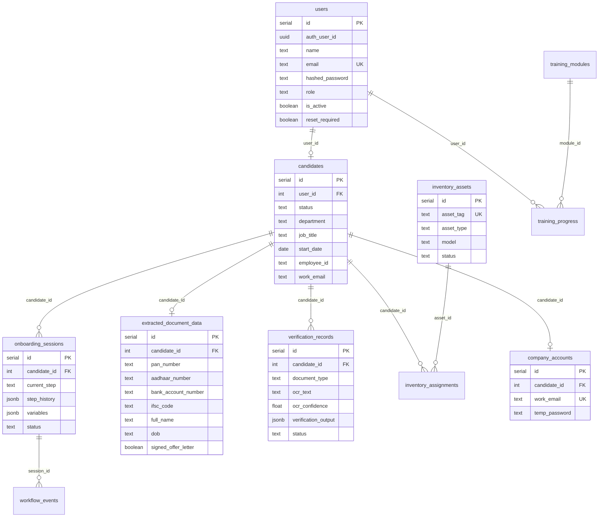

### Tables

| Table | Purpose |
|-------|---------|
| `users` | Authentication users (roles: candidate, hr, it, manager, admin) |
| `candidates` | Onboarding status, department, job_title, employee_id, work_email |
| `onboarding_sessions` | Workflow state machine (current_step, step_history JSONB) |
| `verification_records` | Per-document OCR/verification results |
| `extracted_document_data` | Consolidated KYC fields + signed_offer_letter flag |
| `workflow_events` | Event audit trail per session |
| `inventory_assets` | Hardware catalog (laptops, accessories) |
| `inventory_assignments` | Asset-to-candidate mapping |
| `company_accounts` | Provisioned work email + temp password |
| `email_logs` | Email delivery status |
| `audit_logs` | System audit trail |
| `training_modules` / `training_progress` | Training content (seeded, not in main workflow) |

---

## Frontend Architecture

**Entry:** `index.html` → `src/main.tsx` → `src/App.jsx`  
**Stack:** React 18, Vite 5, React Router 7, Tailwind CSS

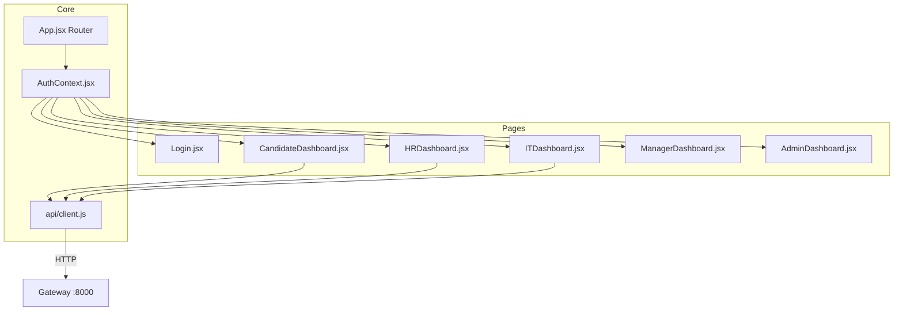

### Components

| Component | Purpose |
|-----------|---------|
| `DocumentUpload.jsx` | PDF upload for aadhaar/pan/bank_passbook |
| `TaskStatusBadge.jsx` | Workflow task status display |
| `ApprovalCard.jsx` | HITL approval UI (approvals stubbed) |
| `SupportChat.jsx` | Chat widget (legacy backend fallback) |

### API Client

**File:** `src/api/client.js`

- Gateway URL: hardcoded `http://localhost:8000`
- JWT stored in `localStorage.user`
- Supabase export is a **mock** (localStorage only)
- Implemented: login, reset password, candidate profile, documents, upload, bank verify, e-sign, HR candidates/invite, IT candidates
- Missing (Admin/Manager will error): `getUsers`, `getAuditLogs`, `getTrainingModules`, `getTrainingProgress`

---

## Authentication & Authorization

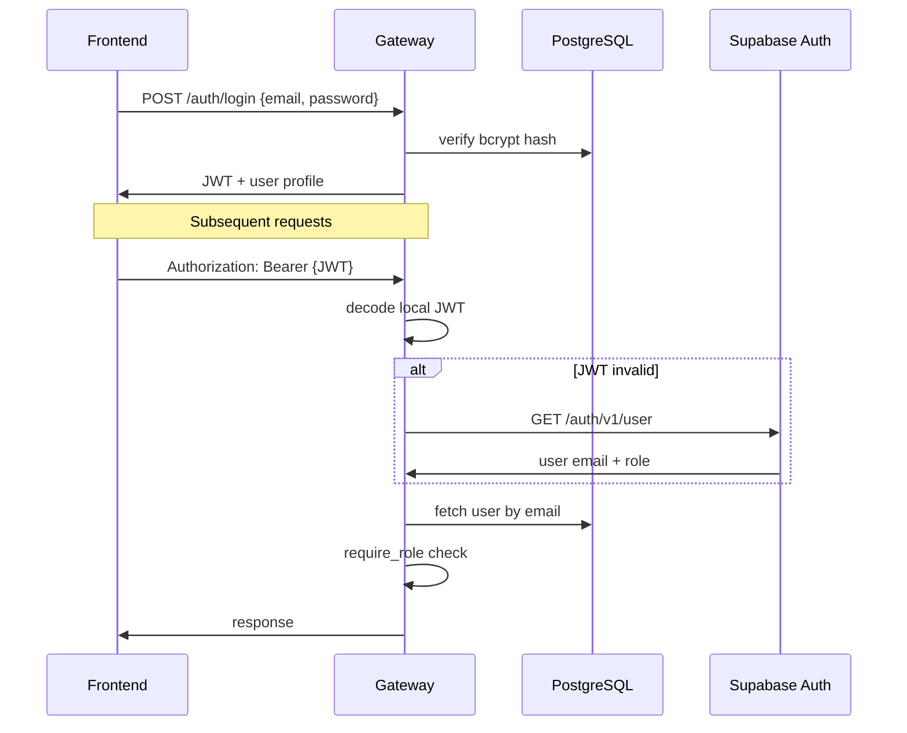

| Mechanism | Detail |
|-----------|--------|
| **Primary** | Local JWT (HS256, 60 min expiry, `JWT_SECRET_KEY`) |
| **Fallback** | Supabase Auth API token validation |
| **Password** | bcrypt hashing via passlib |
| **RBAC** | `require_role(["hr", "admin"])` dependency on routes |
| **Force reset** | `reset_required` flag on user; corporate email swap triggers reset |

---

## Monitoring & Observability

**Prometheus config:** `infrastructure/prometheus/prometheus.yml`

| Scrape Target | Interval | Endpoint |
|---------------|----------|----------|
| api-gateway:8000 | 15s | `/health` |
| ocr-service:8001 | 15s | `/health` |
| verification-service:8002 | 15s | `/health` |
| notification-service:8003 | 15s | `/health` |
| inventory-service:8004 | 15s | `/health` |
| it-service:8005 | 15s | `/health` |

**Grafana:** http://localhost:3001 (admin / admin)

**Limitations:**

- No `/metrics` Prometheus endpoints — only health JSON scraped
- Orchestrator is not scraped
- No pre-provisioned Grafana dashboards in repo
- Redis `monitoring_channel` Pub/Sub has no consumer

---

## Supabase Integration

Supabase is **partially integrated** — not the primary runtime for Docker deployments.

| Component | Status |
|-----------|--------|
| Gateway auth fallback | Validates Supabase JWT via `/auth/v1/user` |
| `.env` | `VITE_SUPABASE_URL`, `VITE_SUPABASE_ANON_KEY` |
| Migrations | `supabase/migrations/` — separate schema with RLS, `documents`, `onboarding_tasks` |
| Edge function | `supabase/functions/onboarding-invite/` — parallel invite flow |
| Frontend | `@supabase/supabase-js` in package.json; runtime uses mock in `client.js` |

**Docker stack uses local PostgreSQL + local JWT**, not Supabase as primary DB.

---

## Legacy Backend Stack

**Path:** `backend/` — **not included in Docker Compose**

| Component | Technology |
|-----------|------------|
| Agents | LangGraph-based workflow agents |
| RAG | ChromaDB vector store |
| Tasks | Celery async workers |
| Support | `/api/support/ask` chat endpoint |

This stack represents an earlier monolithic architecture. The active system uses `apps/`, `agents/`, and `services/` instead.

---

## Security Considerations

| Area | Current State |
|------|---------------|
| Document storage | Ephemeral in-memory only (OCR service) |
| Passwords | bcrypt hashed; temp passwords force reset |
| JWT | HS256 with configurable secret |
| RBAC | Enforced at gateway route level |
| E-sign audit | IP address + timestamp logged |
| SMTP | Credentials from environment only |
| CORS | Configurable origins with localhost defaults |

**Production recommendations:** Rotate `JWT_SECRET_KEY`, use HTTPS, configure real SMTP, add rate limiting, implement Prometheus metrics, and replace destructive `init_db.py` with proper migrations.
